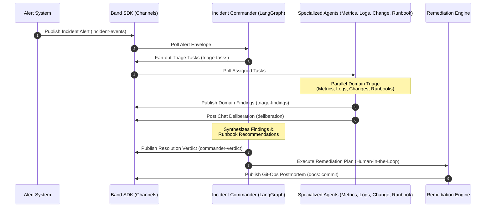

# 🚨 The War Room: AI-Driven Incident Response Platform

> **Hackathon Project Showcase**
> _Automating cloud infrastructure triage, collaborative deliberation, dynamic remediation, and Git-Ops documentation using cooperative AI Agent Swarms._

---

## 📖 Project Overview

When cloud services experience outages or latency spikes, every second counts. Traditional incident response requires on-call engineers to manually check logs, query metrics dashboards, audit recent code deployments, and match current issues against complex runbooks.

**The War Room** is a multi-agent Incident Response platform that automates this critical workflow. It coordinates specialized AI agents using the **Band SDK** protocol, simulating a synchronized "War Room" where agents exchange findings, deliberate on causes, score confidence, and formulate a unified mitigation plan in real-time.



---

## 💎 Key Features (The "Wow" Factors)

### 1. Interactive Human-in-the-Loop Remediation

The platform doesn't just alert; it generates an executable **Remediation Plan** (`lib/remediation.py`). The operator is prompted to run remediation, executing commands (e.g., container rollbacks, scaling replicas, caching setups) sequentially, tracking Mean Time to Resolution (MTTR), and outputting step-by-step progress bars.

### 2. Git-Ops Postmortem Auto-Commit

On incident resolution, the **Incident Commander** automatically compiles a comprehensive Markdown report documenting the timeline, root cause, confidence levels, action items, and the exact evidence trail. It automatically commits this postmortem to Git (`lib/git_ops.py`), yielding a unique commit hash and a clickable GitHub commit link.

### 3. Dynamic Multi-Scenario Loader

Instead of hardcoded events, the project dynamically parses and loads incident datasets from `data/` (`lib/scenario_loader.py`). It features a CLI picker and a sidebar picker on the dashboard for:

- **inc-001 (SEV-2):** API Gateway Latency Spike (Connection pool exhaustion correlation).
- **inc-002 (SEV-3):** User Service Elevated Latency (Degraded slow database queries).
- **inc-003 (SEV-1):** Payment Service Full Outage (Total service crash due to memory leak).

---

## 🛠️ Tech Stack & Agent Frameworks

To demonstrate real-world extensibility, **The War Room** integrates a diverse set of modern LLM agent frameworks, showcasing how they can be unified via a single communication bus (the **Band SDK**):

| Agent Name             | Role                        | Framework / SDK | Primary Logic                                                                                             |
| :--------------------- | :-------------------------- | :-------------- | :-------------------------------------------------------------------------------------------------------- |
| **Incident Commander** | Orchestrator & Synthesizer  | `LangGraph`     | Coordinates task fanning, reviews agent observations, manages evidence/scoring, and issues final verdict. |
| **Metrics Agent**      | Telemetry Analyst           | `CrewAI`        | Analyzes CPU, memory, and database metrics for anomalies.                                                 |
| **Logs Agent**         | Code & Exception Audit      | `Anthropic SDK` | Traces execution threads and logs for crash dumps or 5xx exceptions.                                      |
| **Change Agent**       | Configuration & CI/CD Audit | `Pydantic AI`   | Detects recent production deploys, schema updates, or flag changes.                                       |
| **Runbook Agent**      | Playbook Matcher            | `Claude SDK`    | Checks historical runbooks to recommend immediate mitigation actions.                                     |

---

## ⚖️ Evidence & Confidence Scoring (Phase 4)

The platform features a mathematical confidence scoring engine (`lib/scorer.py`) that reviews independent findings and agent communication:

- **Weighted Domain Scoring:** Baseline weights are allocated based on domain reliability:
  - **Metrics Agent:** `25%`
  - **Logs Agent:** `25%`
  - **Change Agent:** `25%`
  - **Runbook Agent:** `15%`
  - **Deliberation:** `10%`
- **Deliberation Protocol Verbs:** Agent chat logs are scanned for interaction tokens (e.g., `CHALLENGE`, `CONNECT`, `AGREE`, `SURFACE`) to dynamically adjust the system confidence.
- **Incident Status Gating:** Evaluates the final confidence score to determine resolution pathing:
  - **Resolved** (`>= 80%` confidence)
  - **Mitigating** (`>= 50%` confidence)
  - **Escalated** (`< 50%` confidence)

---

## 📁 Repository Directory Structure

```bash
├── agents/             # Dedicated codebases for each AI agent
│   ├── commander/      # Orchestrates alerts, findings, and verdicts (LangGraph)
│   ├── metrics_agent/  # Observability and metrics parsing (CrewAI)
│   ├── logs_agent/     # Application log scanner (Anthropic SDK)
│   ├── change_agent/   # CI/CD and deploy correlation (Pydantic AI)
│   └── runbook_agent/  # Playbook lookup and mitigation (Claude SDK)
├── band/               # Agent specifications and communication channels
│   ├── agents.yaml     # Agent metadata registry
│   └── channels.yaml   # Event-driven message channel mappings
├── data/               # Mock data sources (incidents, runbooks, logs)
│   ├── inc-001/        # API Gateway Latency Spike scenario files
│   ├── inc-002/        # User Service Elevated Latency scenario files
│   └── inc-003/        # Payment Service Full Outage scenario files
├── demo/               # Walkthrough materials and execution scripts
│   ├── demo-script.md  # Detailed step-by-step description of the flow
│   ├── run_demo.py     # Interactive CLI picker and simulation runner
│   └── gen_dashboard_data.py # Compiles on-disk data to ui/scenarios.js database
├── lib/                # Shared utilities, Pydantic models, and client mocks
│   ├── band_client.py  # Mock wrapper mimicking Band SDK communication bus
│   ├── models.py       # Pydantic schemas (Finding, TriageTask, Verdict, Evidence)
│   ├── evidence.py     # In-memory EvidenceStore recording telemetry trails
│   ├── scorer.py       # Weighted confidence scoring & gating logic
│   ├── git_ops.py      # Automated git commits and GitHub URL resolution
│   ├── remediation.py  # Remediation engine and command mapping
│   └── scenario_loader.py # Discovers and loads scenario data configurations
├── ui/                 # Frontend Web Studio
│   ├── assets/         # CSS design tokens and layout stylesheets
│   ├── scenarios.js    # Compiled scenario database for the frontend
│   └── dashboard.html  # Live browser-based dashboard simulation
└── tests/              # Comprehensive test suites verifying agent interactions
```

---

## 🚀 Getting Started & Execution

### 1. Prerequisites

Ensure you have Python 3.10+ installed. Install baseline dependencies:

```bash
pip install pydantic pytest
```

### 2. Running the Interactive CLI Simulation

You can trigger the entire incident response sequence in your console. This prompts you to select a scenario, runs the agents, deliberates, and prompts you to run remediation and commit the generated postmortem:

```bash
python demo/run_demo.py
```

### 3. Launching the Web Dashboard Prototype (Phase 6 UI)

The web dashboard is fully interactive and runs the same scenario pipeline:

- Open the file [ui/dashboard.html](file:///c:/Users/simran%20gupta/Coding/webDevelopment/projects/Not%20so%20completed%20projects/the%20war%20room/ui/dashboard.html) in your browser.
- Select a scenario from the sidebar (e.g. **inc-003 Payment Service Full Outage**).
- Click **"Execute Triage"** to watch the agents diagnose the issue.
- Click **"Run Remediation"** to simulate self-healing actions.
- Click **"Commit to Git"** to trigger a simulated Git commit of the postmortem report.

_(Note: If you modify scenario data, rebuild the frontend database first by running `python demo/gen_dashboard_data.py`)_

### 4. Code Formatting

Format files using **Prettier**:

```bash
npx prettier --write .
```

### 5. Running the Test Suite

Validate the entire agent orchestration, evidence scoring, and Git-Ops lifecycle using pytest:

```bash
python -m pytest
```

---

## 🎯 Implementation Roadmap

- [x] **Phase 1:** Commander Triage (Alert generation & Task fan-out)
- [x] **Phase 2:** Analysis Agents (Metrics, Logs, Change, Runbook diagnostics)
- [x] **Phase 3:** Commander Verdict Formulation (Cross-domain correlation & synthesis)
- [x] **Phase 4:** Evidence, Scoring & Artifact System (Scoring engine & Postmortem generator)
- [x] **Phase 5:** Real Data Pipeline (Integrate metrics, logs, and deploys loader)
- [x] **Phase 6:** Web Dashboard (Minimalist interactive Studio UI prototype with full Remediation & Git-Ops commits)
