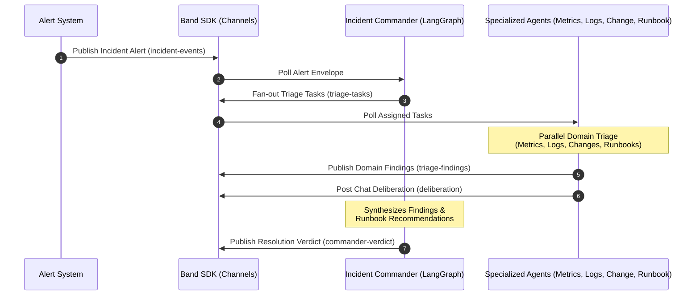

# 🚨 The War Room: AI-Driven Incident Response Platform

> **Hackathon Project Showcase**
> *Automating cloud infrastructure triage, collaborative deliberation, and resolution coordination using cooperative AI Agent Swarms.*

---

## 📖 Project Overview

When cloud services experience outages or latency spikes, every second counts. Traditional incident response requires on-call engineers to manually check logs, query metrics dashboards, audit recent code deployments, and match current issues against complex runbooks.

**The War Room** is a multi-agent Incident Response platform that automates this critical workflow. It coordinates specialized AI agents using the **Band SDK** protocol, simulating a synchronized "War Room" where agents exchange findings, deliberate on causes, score confidence, and formulate a unified mitigation plan in real-time.



---

## 🛠️ Tech Stack & Agent Frameworks

To demonstrate real-world extensibility, **The War Room** integrates a diverse set of modern LLM agent frameworks, showcasing how they can be unified via a single communication bus (the **Band SDK**):

| Agent Name | Role | Framework / SDK | Primary Logic |
| :--- | :--- | :--- | :--- |
| **Incident Commander** | Orchestrator & Synthesizer | `LangGraph` | Coordinates task fanning, reviews agent observations, manages evidence/scoring, and issues final verdict. |
| **Metrics Agent** | Telemetry Analyst | `CrewAI` | Analyzes CPU, memory, and database metrics for anomalies. |
| **Logs Agent** | Code & Exception Audit | `Anthropic SDK` | Traces execution threads and logs for crash dumps or 5xx exceptions. |
| **Change Agent** | Configuration & CI/CD Audit | `Pydantic AI` | Detects recent production deploys, schema updates, or flag changes. |
| **Runbook Agent** | Playbook Matcher | `Claude SDK` | Checks historical runbooks to recommend immediate mitigation actions. |

---

## ⚖️ Evidence & Confidence Scoring (Phase 4)

The platform features a mathematical confidence scoring engine (`lib/scorer.py`) that reviews independent findings and agent communication:
- **Weighted Domain Scoring:** Baseline weights are allocated based on domain reliability:
  - **Metrics Agent:** `25%`
  - **Logs Agent:** `25%`
  - **Change Agent:** `25%`
  - **Runbook Agent:** `15%`
  - **Deliberation:** `10%`
- **Deliberation Protocol Verbs:** Agent chat logs are scanned for interaction tokens (e.g., `CHALLENGE`, `CONNECT`, `AGREE`, `SURFACE`) to dynamically adjust the system confidence.
- **Incident Status Gating:** Evaluates the final confidence score to determine resolution pathing:
  - **Resolved** (`>= 80%` confidence)
  - **Mitigating** (`>= 50%` confidence)
  - **Escalated** (`< 50%` confidence)

---

## 📁 Repository Directory Structure

```bash
├── agents/             # Dedicated codebases for each AI agent
│   ├── commander/      # Orchestrates alerts, findings, and verdicts (LangGraph)
│   ├── metrics_agent/  # Observability and metrics parsing (CrewAI)
│   ├── logs_agent/     # Application log scanner (Anthropic SDK)
│   ├── change_agent/   # CI/CD and deploy correlation (Pydantic AI)
│   └── runbook_agent/  # Playbook lookup and mitigation (Claude SDK)
├── band/               # Agent specifications and communication channels
│   ├── agents.yaml     # Agent metadata registry
│   └── channels.yaml   # Event-driven message channel mappings
├── data/               # Mock data sources (incidents, runbooks, logs)
│   └── inc-001/        # Incident simulation config containing alert JSON
├── demo/               # Walkthrough materials and execution scripts
│   ├── demo-script.md  # Detailed step-by-step description of the flow
│   └── run_demo.py     # Runnable console-based simulation script
├── lib/                # Shared utilities, Pydantic models, and client mocks
│   ├── band_client.py  # Mock wrapper mimicking Band SDK communication bus
│   ├── models.py       # Pydantic schemas (Finding, TriageTask, Verdict, Evidence)
│   ├── evidence.py     # In-memory EvidenceStore recording telemetry trails
│   ├── scorer.py       # Weighted confidence scoring & gating logic
│   └── artifact_generator.py # Generates markdown postmortems and status updates
├── ui/                 # Frontend Web Studio
│   ├── assets/         # CSS tokens and layout stylesheets
│   └── dashboard.html  # Live browser-based dashboard simulation
└── tests/              # Comprehensive test suites verifying agent interactions
```

---

## 🚀 Getting Started & Execution

### 1. Prerequisites
Ensure you have Python 3.10+ installed. Install baseline dependencies:
```bash
pip install pydantic
```

### 2. Running the Interactive CLI Simulation
You can trigger the entire incident response sequence in your console. This runs the commander, feeds telemetry to agents, processes findings/deliberations, calculates confidence scores, generates markdown postmortems, and outputs the resolution actions:
```bash
python demo/run_demo.py
```

### 3. Launching the Web Dashboard Prototype (Phase 6)
Open the styled incident dashboard prototype in your web browser:
- Locate the file [ui/dashboard.html](file:///c:/Users/simran%20gupta/Coding/webDevelopment/projects/Not%20so%20completed%20projects/the%20war%20room/ui/dashboard.html) and open it in any standard browser.
- Click **"Execute Triage"** to simulate the real-time swarm orchestration, agent completion bars, and the final resolution output.

### 4. Running the Test Suite
Validate all agents, the evidence store, scoring, and verdict generators:
```bash
python -m pytest
```

---

## 🎯 Implementation Roadmap

- [x] **Phase 1:** Commander Triage (Alert generation & Task fan-out)
- [x] **Phase 2:** Analysis Agents (Metrics, Logs, Change, Runbook diagnostics)
- [x] **Phase 3:** Commander Verdict Formulation (Cross-domain correlation & synthesis)
- [x] **Phase 4:** Evidence, Scoring & Artifact System (Scoring engine & Postmortem generator)
- [ ] **Phase 5:** Real Data Pipeline (Integrate live metrics APIs and deployment webhooks)
- [x] **Phase 6:** Web Dashboard (Minimalist interactive Studio UI prototype)
